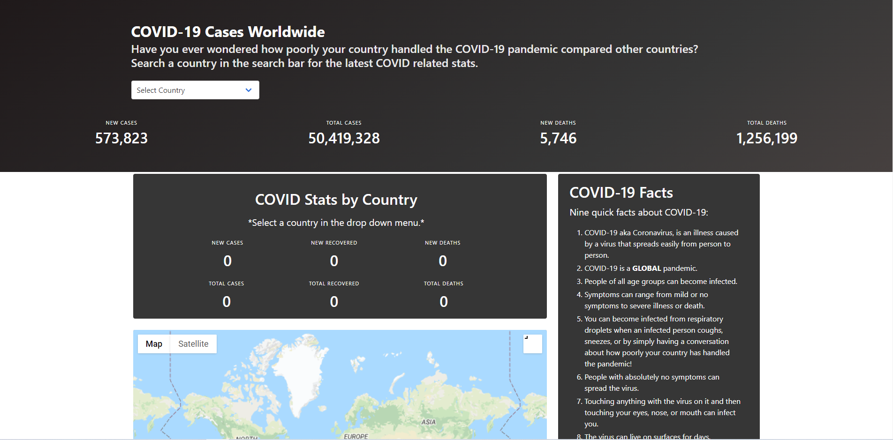

# Covid Tracker
## [Application Link](https://kfreeborg.github.io/week-7-project/)

## Screenshot

This is a global Covid-19 tracker that allows the user to search any country in the world and obtain the number of covid cases in that location. Along with this, the covid tracker provides the user with important covid-related facts as well as a total count of cases and deaths world-wide. 

# Uses 
To be aware of how wide-spread covid is and to check your location to stay safe and avoid covid.

# Built With
- HTML
- CSS
- Javascript
- Bulma
- Bing Maps API
- Covid-19 API 

# Contributors
- Kelsey Freeborg
- Emily Thai
- Victor Rodriguez
- Riley Beach